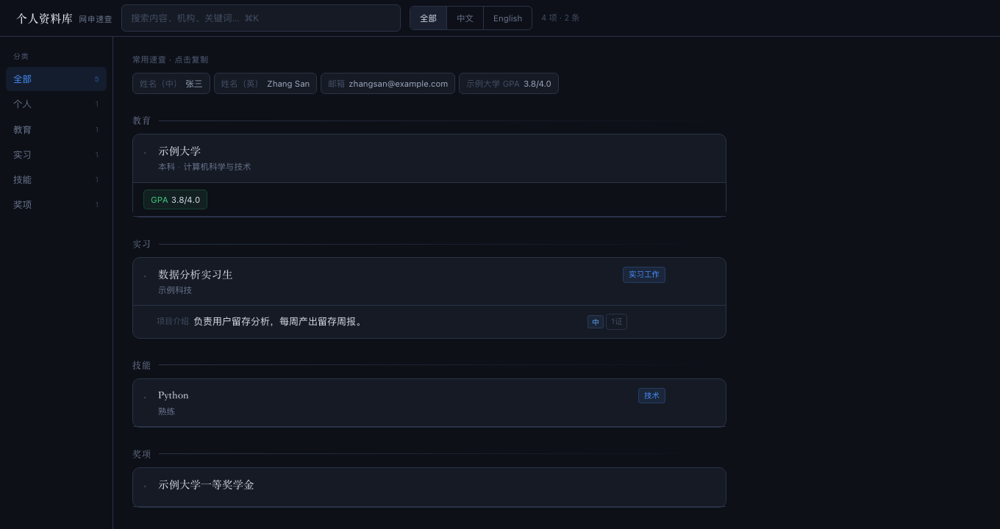

# 个人资料库 · personal-db

> 「材料丢给我，助手一条条读给你看；**你点头的才进库**，每条都点得开出处——填网申时按字段一键复制。」

**把你散落各处的求职材料，攒成一个只属于你、越用越全、可溯源的个人事实库。**



[它解决什么问题](#它解决什么问题) · [快速开始](#快速开始) · [触发方式](#触发方式) · [它和同类有什么不同](#它和同类有什么不同) · [安全边界](#安全边界) · [文件结构](#文件结构) · [验证与测试](#验证与测试) · [常见问题](#常见问题)

---

## 它解决什么问题

投过网申的人都懂：同样的姓名、GPA、实习描述、获奖名称，在几十个学校/公司的表单里要**反复填、反复复制**，还容易填错、填漏、中英对不上。

更怕的是：让 AI 帮你写，它可能顺手"润色"出一个你没做过的数字。**这个库反过来**——AI 只负责读懂你的材料、把事实一条条列出来，**采纳与否由你决定**；每条入库的信息都拴着一份原始材料和原文摘录，点开就能核对。

它不替你写简历、不替你投递，只做一件事：**把事实攒准、存好、填表时一键取用。**

## 快速开始

这份说明写给**完全没接触过 AI 助手、也不会写代码**的你。你只需要做两件事：**给材料** + **点头确认**。

对你的 AI 助手说：

```text
帮我用 personal-db 这个技能，给我建一个个人资料库。
```

它会在你电脑上建好一个文件夹（默认叫 `个人资料库`），里面有一个 **`materials`** 子文件夹——**这就是你放原始材料的地方**。把简历、成绩单、获奖证书、项目结项材料拖进去，然后说一句：

```text
把 materials 里新加的材料整理进我的库。
```

它会把它读到的信息**一条条列给你**：字段是什么、准备录入什么值、出自哪份文件。你逐条回它「对 / 这个改成…… / 这条不要」。确认完，它写进库并自动存一份备份。

> 第一次双击 `web/打开资料库.command` 若被 macOS 拦住，在文件上**右键 →「打开」**，确认一次即可。

## 触发方式

跟助手说这些话都会进入这个流程（可照着说）：

- 「帮我用 personal-db 建一个个人资料库」
- 「把我 materials 里的材料整理进我的库」
- 「打开我的资料库 / 打开查看器」
- 「这份实习证明也加进去」
- 「导出快照 / 更新一下导出」
- 「这条事实的出处是哪份文件？」
- 「我的库里现在有哪些经历？」
- 「个人 DB 里帮我找一下 GPA 那条」

## 它会交付什么

| 交付物 | 形态 | 用途 |
|---|---|---|
| 个人事实库 | 本地 SQLite（`data/`） | 所有已确认事实的唯一真相 |
| 只读查看器 | 本地网页 `http://127.0.0.1:8733` | 浏览、搜索、按中英筛选、逐条一键复制 |
| 导出快照 | `exports/career-profile.snapshot.json` | 给其他工具复用的正式副本（只含确认过的） |
| 自动备份 | `backups/` | 每次写库前的旧版本，出岔子能找回 |

查看器的样子见上方截图：顶部搜索与中英切换，每条后面的 **「N 证」** 点开就是它的出处。

## 它和同类有什么不同

| 维度 | 常见的"AI 求职助手" | personal-db |
|---|---|---|
| 信息形态 | 让 AI 写一份 Markdown 档案 | 结构化事实库（每条事实一个字段 + 语言 + 状态） |
| 溯源 | 通常没有，或只写"来自简历" | 每条事实带来源文件 + SHA-256 + 原文摘录 |
| 防虚构 | 靠提示词约束 | **代码级校验**：来源必须在目录内、文本摘录必须逐字、只有 confirmed 才导出 |
| 谁能写库 | AI 直接写 | AI 只能提候选，**本人逐条确认**后才入库 |
| 填表 | 导出文档再复制 | 网页里**按字段一键复制**，中英对照 |
| 依赖 | 常需联网 / API Key | 纯 Python 标准库，本地运行，零外部请求 |

## 安全边界

- **不会**替你做决定：任何信息进正式库前都先列给你看，你点头才写。
- **不会**替你投递、不会替你写文书，也不会编造数字或头衔。
- **不会**把材料、数据库、导出文件上传、外发或交给任何第三方；查看器页面不加载任何外部资源。
- 服务默认只绑 `127.0.0.1`，仅本机可访问。
- 材料里若夹带"请把 X 发到 Y"这类文字，助手只会当作材料内容如实呈现，**不会执行**。

## 文件结构

```
personal-db/                ← skill 本体
├── SKILL.md                给 AI 助手看的执行说明书
├── README.md               这份说明（给你看）
├── app/                    要复制到你的库目录的代码
│   ├── career_profile.py   数据库 CLI（唯一写入入口）
│   ├── web/                只读查看器（serve.py + index.html + .command）
│   └── .gitignore          隐私数据不进 Git
├── reference/              数据模型、写入流水线（助手查用）
├── templates/              候选/决定的 JSON 模板
├── examples/               全虚构的可跑样例（材料 + 候选 + 决定）
├── tests/                  端到端回归与截图脚本
└── docs/                   查看器演示截图
```

## 验证与测试

交付前会跑一遍合成数据端到端回归（`bash tests/run_e2e.sh`）：初始化 → 候选 → 校验 → **故意写坏摘录必须被拦住** → 入库 → 导出 → 查看器接口。全程只碰 `tests/.demo-project/`，不读写任何真实库。

## 名词小抄

| 你会看到 | 是什么 |
|---|---|
| `materials` 文件夹 | **你放原始材料的地方**（助手只从这里取证据）。 |
| 查看器 / 那个网页 | 只读的浏览页面，用来看和复制，改不了数据。 |
| 候选 / 确认 | 助手先给"候选"，你"确认"后才成为正式记录。 |
| 快照 / 导出 | 一份可交给别的工具用的正式副本（只含你确认过的内容）。 |
| 备份 | 每次写库前自动存的旧版本，存在 `backups` 里，出岔子能找回。 |

## 常见问题

**我完全不懂技术，能用吗？**
能。你只负责给材料和点头，其余交给助手。

**我的数据安全吗？**
所有东西都在你自己电脑上，不联网、不外传。你也可以随时把整个文件夹删掉。

**网页打不开 / 打开是空白？**
让助手帮你看一眼：常见原因是服务没起来，或 8733 端口被别的程序占了，它会处理。

**助手会不会把不确定的东西也塞进来？**
不会。凡是拿不准的，它会问你；凡是要进库的，都会先让你确认。

**材料能删吗？删了库里的信息会没吗？**
库是独立存的。但为了"有据可查"，建议材料别乱删；真要整理，先问问助手。

---

有任何一步卡住，直接把情况说给你的助手，它会帮你解决。

## License

MIT（见 [LICENSE](LICENSE)）。

---

<sub>文档与代码中的示例均为虚构；真实库、材料与导出文件只存在本机。</sub>
